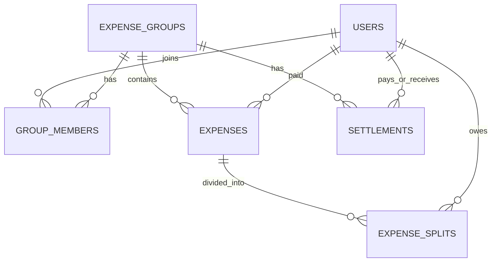

# Expense Splitter

A Splitwise-style REST API for splitting group expenses, with a debt-simplification algorithm that minimizes the number of payments needed to settle up.

## Features
- JWT authentication (Spring Security, BCrypt password hashing)
- Groups with admin/member roles; only members can see group data
- Three split types: equal, exact amounts, percentages (BigDecimal, no lost paise)
- Balances and simplified settlements ("C pays A 400, C pays B 100")
- Two-step payment confirmation (payer records, receiver confirms)
- Expense history with filters (date, member, category) and pagination
- Global exception handling, validation, Swagger docs, unit tests, Docker

## Tech stack
Java 17, Spring Boot 4, Spring Security + JWT, Spring Data JPA (Hibernate), MySQL 8, JUnit 5 + Mockito, springdoc OpenAPI, Docker Compose

## How settlement simplification works
1. **Net balance per person** = total paid - total owed.
   Example: A pays 900 and B pays 600 for dinner and a cab split 3 ways, so A = +400, B = +100, C = -500.
2. **Greedy matching:** repeatedly match the biggest debtor with the biggest creditor and settle the smaller amount. That clears at least one person per step, giving at most n-1 payments in O(n log n).
3. Result: C pays A 400 and C pays B 100 (2 payments instead of a tangle).

Greedy is not guaranteed to be the true minimum (that problem is NP-hard); it is the standard practical trade-off.

## Database design


## Run locally
```bash
git clone https://github.com/YOUR_USERNAME/expense-splitter.git
cd expense-splitter
cp .env.example .env     # then edit .env with your own values
docker compose up --build
```
Swagger UI: http://localhost:8080/swagger-ui.html
Use **Authorize** with the token from `/api/auth/login`.

## Tests
```bash
./mvnw test
```

## Design decisions
- Explicit `GroupMember` entity (role, joinedAt) instead of a plain `@ManyToMany`
- `BigDecimal` for money; leftover paise handed out so shares always sum to the total
- Authorization checked in the service layer on every group endpoint
- `@Version` optimistic locking on expenses and settlements
- Pagination fetches page ids first, then details, to avoid in-memory paging

## Roadmap
- React frontend
- CSV/PDF export, spending analytics, email notifications, multi-currency
- Validate that a recorded payment cannot exceed the current debt